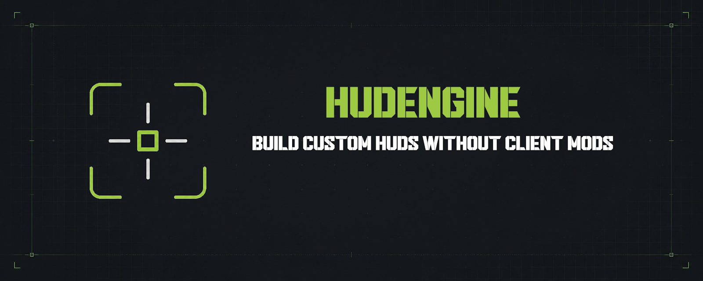

<div align="center">



[](LICENSE)
[](https://adoptium.net/)
[](https://papermc.io/)
[](https://bstats.org/plugin/bukkit/HUDEngine/32968)

🌎 Choose language: [English (EN)](README.md) · **Русский (RU)**

</div>

---

**HUDEngine** — плагин для Minecraft 1.21.4+, позволяющий владельцам серверов Paper и Folia создавать
современные HUD-интерфейсы без установки игроками клиентских модификаций. Со стороны игрока
необходим лишь ресурспак, генерируемый плагином и отправляемый сервером.

HUDEngine принимает YAML-файлы, генерируя на их основе комбинацию глифов, которые размещаются с
огромным отрицательным смещением (`ascent`) далеко за пределами экрана. Сгенерированный шейдер
(`rendertype_text`) распознаёт эти глифы и возвращает их на место — это и есть тот самый
HUD-интерфейс без сторонних модификаций клиента. Всё это выводится через боссбар, а игроку достаточно
установить сгенерированный ресурспак.

## Преимущества плагина

- **Один пак на все версии.** Клиенты Minecraft с 1.21.4 по 26.2 сами выбирают подходящие им ассеты.
- **Простота использования.** Минимум папок и обязательных настроек. Вся информация по настройке
  описана в документации, а открытый код даст дополнительные разъяснения.
- **Оптимизация.** HUD пересобирается только для тех игроков, у кого он включён. Отрисовка
  кэшируется на двух уровнях, и если ничего не изменилось, пакет не отправляется вообще.
- **Ошибки в конфигах объясняются, а не прячутся.** Плагин называет конкретный файл и элемент
  конфигурации, вызвавший проблему, и предлагает исправление при опечатке.
- **Скрытие ванильного HUD.** Возможность опционального скрытия ванильного интерфейса: хп, голод,
  броня, уровень, шкала опыта, хотбар и другое.
- **Встроенный движок плейсхолдеров и condition.** Плагин самостоятельно отображает хп, голод и
  другие базовые параметры без сторонних зависимостей, а система condition позволяет отслеживать
  состояния игрока.
- **Открытое API.** Полное управление HUD-частью в собственных плагинах, что особенно полезно в
  контексте компаса: персональные маркеры, отображение игроков поблизости, квестовые точки и прочее.
- **Продвинутый компас.** Компас не только определяет направление, но и поддерживает метки —
  постоянные (задаются в конфигах) и динамические (через API).
- **Совместим с конфигами BetterHud.** Перенос сводится к копированию папки с конфигурацией, за
  исключением попапов и анимаций, а поддерживаемые HUDEngine возможности опционально интегрируются
  поверх.
- **Небольшой размер пака.** Базовый размер генерируемого ZIP-архива составляет около 230 КБ, что не
  заставляет игроков долго ждать. Маловероятно, что пак превысит 1 МБ даже при большом количестве
  HUD-элементов.
- **Прямая раздача.** Настройка раздачи пака прямо с игрового сервера, без веб-сервера. Текст
  сообщения о загрузке и обязательность (кикает ли за отказ) полностью настраиваются.

## Требования
Paper или Folia 1.21.4 — 26.2 (Java 21—25).
Никаких сторонних плагинов не нужно.

## Создание худа

Плагин генерирует базовый пакет ресурсов при первом запуске: голова игрока, бары хп, голода и
кислорода, координаты и компас. Это лишь примитивный пример того, каким может быть
HUD-интерфейс и пример для разбора конфигов.


Как усовершенствовать и кастомизировать — решать вам. Всё необходимое для создания
современного и детализированного HUD есть в вики плагина: [перейти](https://github.com/Nacvark/HUDEngine/wiki).

<details>
<summary><b>🎥 Пример production-версии худа</b></summary>

**▶️ Нажмите на изображение, чтобы посмотреть демонстрацию на YouTube**

[](https://youtu.be/NZtoazEHZ2A)

</details>

## Раздача ресурспака

Плагин собирает пак в `plugins/HUDEngine/build/HUDEngine.zip`. Как он попадёт оттуда к игроку —
единственное решение, которое нужно принять, и принять его можно тремя способами.

```yaml
resource-pack:
  delivery: none   # none | url | host
```

**`host` — сервер раздаёт сам.** Обычный ответ и то, к чему стоит тянуться на панельном хостинге, где
у вас есть игровой сервер и больше ничего. Плагин поднимает маленький HTTP-сервер: ни веб-сервера, ни
файлового хостинга, ни загрузки файла после каждой правки:

```yaml
resource-pack:
  delivery: host
  host:
    bind: "0.0.0.0"
    port: 8123
    path: "/hudengine.zip"
    public-url: "http://адрес-вашего-сервера:8123/hudengine.zip"
```

`public-url` должен быть адресом сервера, к которому постучится игрок. Не `localhost` и не
`127.0.0.1` — указываем IP-сервера с доступным портом.

**Тестируете на своём ПК?** Сервер на localhost — единственный случай, когда `localhost` в
`public-url` уместен. Это работает, пока вы тестируете, и перестаёт работать в момент, когда сервер
будет доступен игрокам.

**`url` — пак уже опубликован.** Если вы держите паки на своём хостинге, на CDN или где угодно, где
есть прямая ссылка на скачивание, укажите её в `resource-pack.url`, и плагин её отправит. Хеш
по-прежнему считается по реально собранному файлу, поэтому устареть он не может.

**`none` — просто сборка файла.** Для серверов, которые уже раздают паки своим способом.
Плагин пишет архив в `plugins/HUDEngine/build/` и больше ничего не делает. Способы раздачи остаются
за вами.

Что бы вы ни выбрали: пак побайтово одинаков между сборками, пока конфигурация не менялась, поэтому
клиенты не перекачивают то, что у них уже есть. Если вы уже отправляете свои паки, перечислите их в
`extra-packs`, и всё придёт одним окном. Подробности — на странице вики
[Ресурспак](https://github.com/Nacvark/HUDEngine/wiki/Resource-Pack-RU).

## Команды и права

Сокращённо `/hud`. Все команды по умолчанию доступны только оператору (op).

| Команда | Описание | Право |
|---|---|---|
| `/hudengine toggle [игрок]` | Включить или выключить HUD | `hudengine.command.toggle` |
| `/hudengine show <худ> [игрок]` | Добавить худ в набор игрока | `hudengine.command.show` |
| `/hudengine hide <худ> [игрок]` | Убрать один | `hudengine.command.hide` |
| `/hudengine reset [игрок]` | Вернуть набор по умолчанию | `hudengine.command.reset` |
| `/hudengine list [игрок]` | Что существует и что сейчас видно | `hudengine.command.list` |
| `/hudengine reload` | Пересобрать конфигурацию | `hudengine.command.reload` |
| — | Выполнение команды в отношении другого игрока | `hudengine.command.others` |
| — | Всё перечисленное | `hudengine.admin` |

`hudengine.command.others` отвечает за возможность указать в команде другого игрока и проверяется
вдобавок к праву самой команды. Это заодно делает его маленькой точкой интеграции: плагин катсцен
(или что угодно ещё), умеющий выполнять серверные команды, может скрыть игроку HUD через
`/hud toggle <игрок>`, не трогая API.

## Для разработчиков

Весь код является открытым и распространяется по лицензии MIT. Ознакомиться с ним можно
[здесь](https://github.com/Nacvark/HUDEngine).

| Модуль | Назначение |
|---|---|
| `hudengine-api` | Публичный API для других плагинов. Именно от этого модуля следует зависеть. |
| `hudengine-core` | Компилятор и движок рендеринга. Только JDK. |
| `hudengine-paper` | Платформенный слой для Paper/Folia. |
| `hudengine-cli` | Автономный компилятор паков. |
| `hudengine-plugin` | Распространяемый JAR-файл. |

API лежит в Maven Central. Добавить его в свой плагин можно:

```xml
<dependency>
    <groupId>io.github.nacvark</groupId>
    <artifactId>hudengine-api</artifactId>
    <version>1.0.0</version>
    <scope>provided</scope>
</dependency>
```

```kotlin
compileOnly("io.github.nacvark:hudengine-api:1.0.0")
```

Также добавьте `softdepend: [HUDEngine]` в свой `plugin.yml` и получите движок через реестр сервисов
Bukkit:

```java
HudEngineProvider.find().ifPresent(hud ->
        hud.values().register("myplugin:mana", player -> String.valueOf(manaOf(player))));
```

Теперь `[myplugin:mana]` работает в любом паттерне HUD. Более подробные примеры — провайдеры компаса,
показ HUD на время, измерение текста — описаны на странице вики
[API](https://github.com/Nacvark/HUDEngine/wiki/API-RU).

## Лицензия

MIT — см. [LICENSE](LICENSE). Уведомления о стороннем коде в [NOTICE.md](NOTICE.md).

---

## Поддержать автора

Плагин является полностью бесплатным, но вы можете поддержать меня: [DONATE.md](DONATE.md).

---
